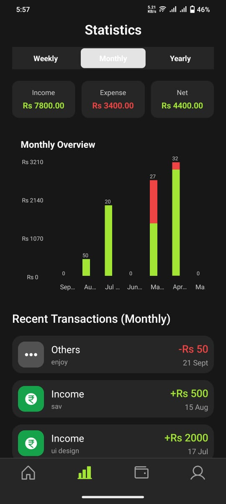
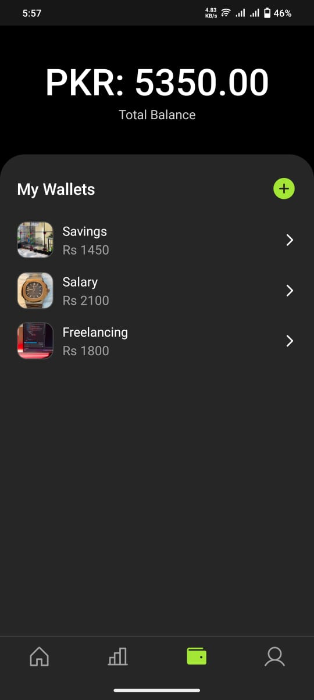
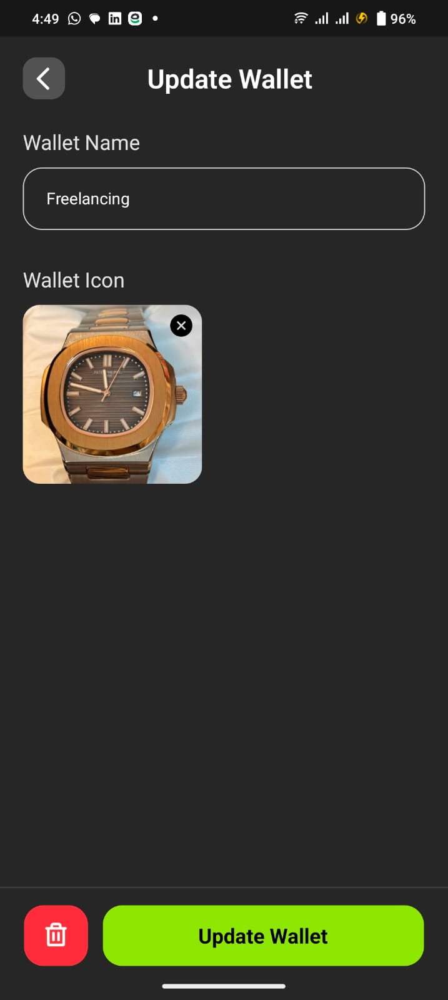
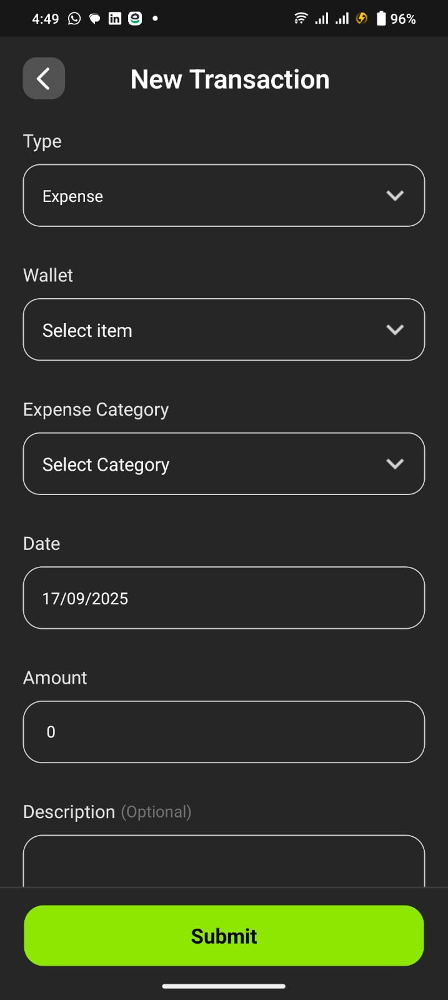
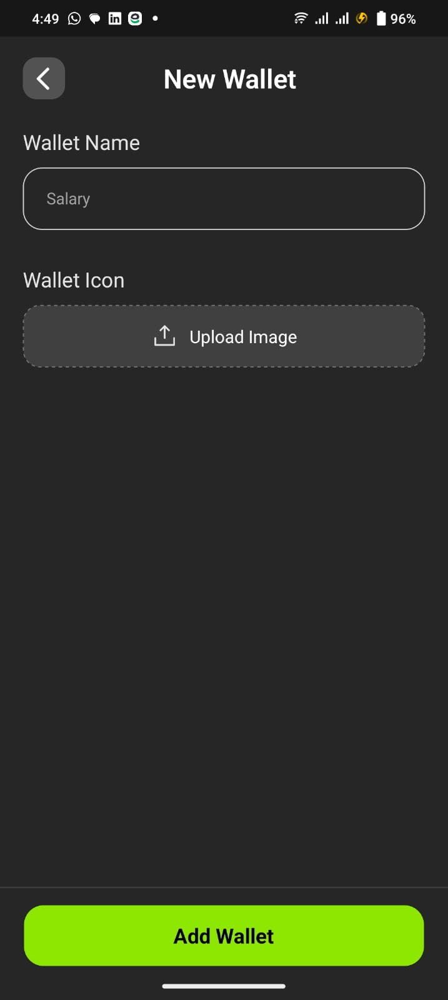
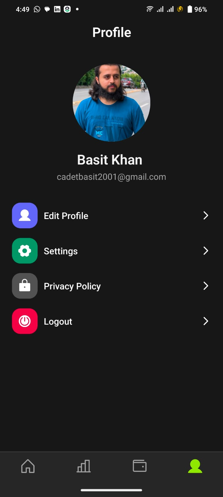
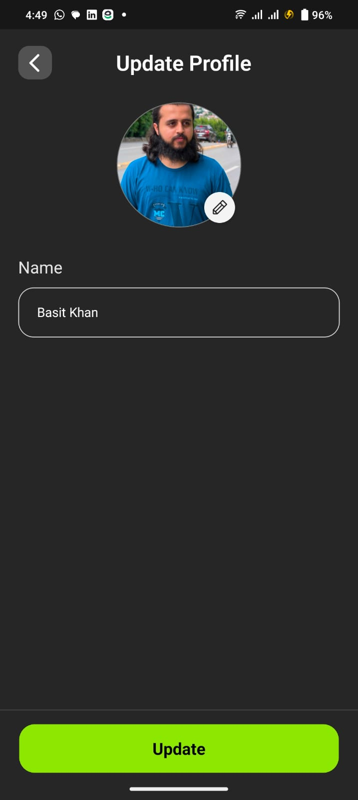

💰 Finance Tracker App
A comprehensive mobile application built with React Native for tracking income and expenses across multiple wallets with detailed statistics and visualization.

https://img.shields.io/badge/React_Native-20232A?style=for-the-badge&logo=react&logoColor=61DAFB
https://img.shields.io/badge/Firebase-FFCA28?style=for-the-badge&logo=firebase&logoColor=black
https://img.shields.io/badge/TypeScript-007ACC?style=for-the-badge&logo=typescript&logoColor=white

📸 App Screenshots
<table> <tr> <td align="center">    <b>Home Overview</b> </td> <td align="center">    <b>Statistics</b> </td> <td align="center">    <b>Wallet</b> </td> </tr> <tr> <td align="center">    <b>Update Wallet</b> </td> <td align="center">    <b>Add Expense/Income</b> </td> <td align="center">    <b>Create a New Wallet</b> </td> </tr> <tr> <td align="center">    <b>Profile</b> </td> <td align="center">    <b>Update Profile</b> </td> <td align="center">    <b>Splash</b> </td> </tr> </table>
✨ Features
Multi-Wallet Management: Create and manage multiple wallets with individual balances

Transaction Tracking: Record income and expenses with detailed categorization

Advanced Statistics: Interactive charts for weekly, monthly, and yearly financial overview

Visual Analytics: Beautiful bar charts showing income vs expense comparisons

Cloud Synchronization: Secure data storage with Firebase Firestore

Receipt Management: Attach images to transactions for better record keeping

Responsive Design: Optimized for both iOS and Android devices

🛠️ Tech Stack
Frontend: React Native with TypeScript

Navigation: Expo Route

State Management: React Context API

Backend: Firebase (Firestore, Authentication)

Charts: React Native Gifted Charts

Image Processing: Cloudinary integration

UI Components: Custom design system with consistent theming

🚀 Getting Started
bash
# Clone the repository
git clone https://github.com/HafizBasit7/Expense-Tracker-app
cd expense-tracker

# Install dependencies
npm install

# Setup Firebase configuration
# Update config/firebase.ts with your Firebase project details

# Run the application
npx react-native run-android
# or
npx react-native run-ios
📖 Usage Guide
Create Wallets: Start by adding your financial wallets (cash, bank accounts, digital wallets)

Add Transactions: Record income and expenses with categories and optional images

View Statistics: Switch between weekly, monthly, and yearly views in the statistics tab

Analyze Trends: Use the interactive charts to understand your spending patterns

Manage Data: Edit or delete transactions as needed with automatic wallet balance updates

🔧 Configuration
Firebase Setup
Create a new Firebase project at Firebase Console

Enable Firestore Database and Authentication

Update the Firebase configuration in config/firebase.ts

Environment Variables
Create a .env file in the root directory:

env
FIREBASE_API_KEY=your_api_key
FIREBASE_AUTH_DOMAIN=your_project_id.firebaseapp.com
FIREBASE_PROJECT_ID=your_project_id
FIREBASE_STORAGE_BUCKET=your_project_id.appspot.com
FIREBASE_MESSAGING_SENDER_ID=your_sender_id
FIREBASE_APP_ID=your_app_id
CLOUDINARY_CLOUD_NAME=your_cloud_name
CLOUDINARY_UPLOAD_PRESET=your_upload_preset
📊 API Reference
Transaction Services
javascript
// Create or update transaction
createOrUpdateTransaction(transactionData)

// Fetch weekly statistics
fetchWeeklyStats(userId)

// Fetch monthly statistics
fetchMonthlyStats(userId)

// Fetch yearly statistics
fetchYearlyStats(userId)

// Delete transaction
deleteTransaction(transactionId)
Wallet Services
javascript
// Create or update wallet
createOrUpdateWallet(walletData)

// Get user wallets
getUserWallets(userId)
🤝 Contributing
We welcome contributions! Please feel free to submit pull requests or open issues for bugs and feature requests.

Fork the project

Create your feature branch (git checkout -b feature/AmazingFeature)

Commit your changes (git commit -m 'Add some AmazingFeature')

Push to the branch (git push origin feature/AmazingFeature)

Open a pull request

📄 License
This project is licensed under the MIT License - see the LICENSE file for details.

🙏 Acknowledgments
React Native community for excellent documentation and support

Firebase team for robust backend services

Contributors and testers who helped improve the application

📞 Support
If you have any questions or need help with setup:

Check the FAQ section

Open an issue on GitHub

Contact us at hafiz.zes7@gmail.com

⭐ Don't forget to star this repo if you found it helpful!

